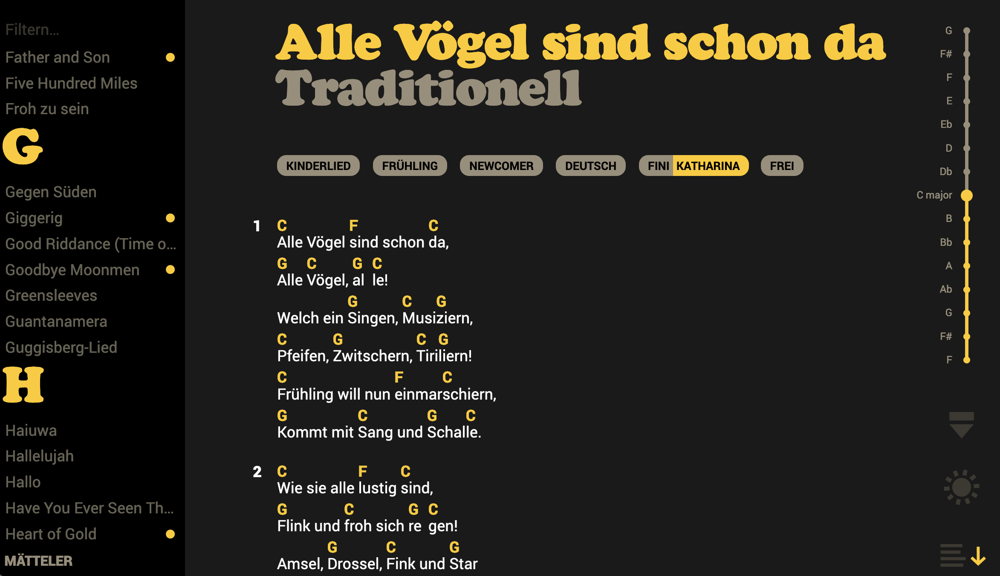
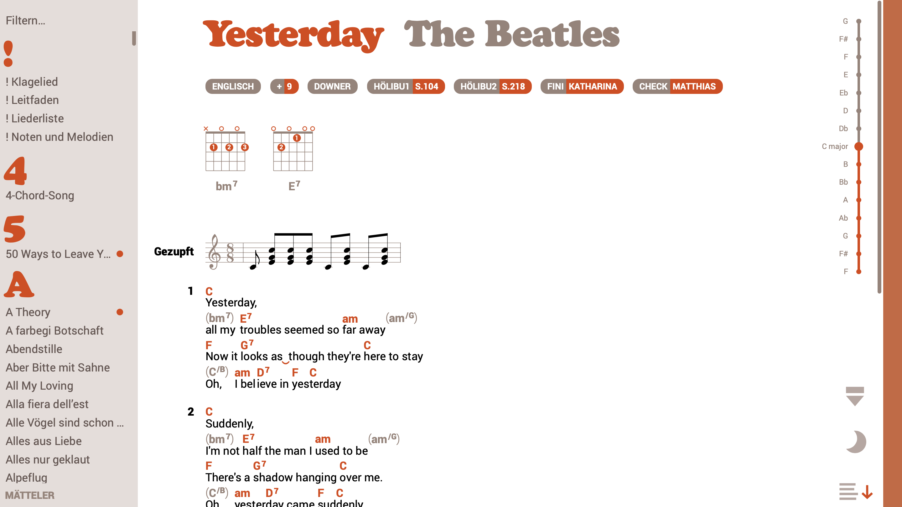

# Rechords 

A Songbook Wiki. Key features:

- Song sheets with lyrics and chord annotations on smartphones, tablets and big screens
- Song sheet viewer with transposing and autoscroll support
- Markdown based document format
- Easy editing with live-preview and versioning






# Getting Started

* Install Meteor https://docs.meteor.com/install.html
* make sure you are using an adequate node version ( 10 - 14 ) -> install nvm otherwise to switch when needed

* change to app folder, install npm packages, start the App

```
cd app
meteor npm i
meteor
```
If everything is successfull you should see the following
```
=> Started proxy.
=> Started MongoDB.
...
```

# Local Development

## Executing Tests

### Unit Tests

So far most unit tests are for the showdown parser and a few util classes.
Behaviour of the meteor / react components is not really unit tested (yet?) but okayish handled by the playwright tests

```bash
npm test
```


### E2E Tests

To run e2e tests with playwright gui use:

```bash
npm run test:e2e
```

And for executing playwright tests without ui, use:
```bash
npm run ci:test:e2e
```


To test as CI would (fresh clone of current branch in isolated folder):

```bash
./run-e2e.sh
```

This will locally clone your current branch into test-instances. 
It helps you to quickly test against a clean DB without the need
to reset your dev DB in the app folder.
